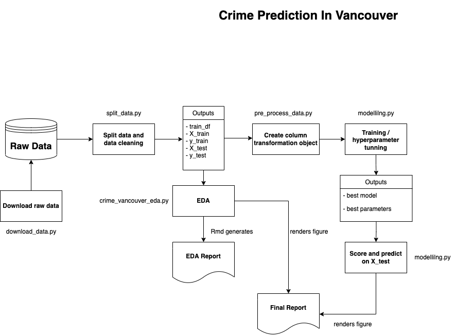

# Crime Prediction in Vancouver

-   contributors: Ramiro Francisco Mejia, Jasmine Ortega, Thomas Siu,
    Shi Yan Wang

This is the data analysis project of group 24 (Cohort 6, 2022) for DSCI
522 (Data Science workflows); a course in the Master of Data Science
program at the University of British Columbia.

## Our Motivation

One of the famous science fictions *The Minority Report* plots the
future world, where police utilize technology to predict and arrest
criminals before the crime happens. Put aside the ethical debates of the
arrestment, we believe it is still essential to identify and predict
crimes with good purpose. For example, can we predict the kinds of crime
would possibly happen, given a certain neighbourhood and time? Police
would then be able to strengthen specific skillsets to cater such
law-breaching activities. Also, local government officials could utilize
the prediction to adjust related policies.

We are going to build a classification prediction model to predict the
types of crimes that happens in Vancouver, based on the location and the
time of the day. The data set that is used in the project is originated
from The Vancouver Police Department (VPD) (The Vancouver Police
Department 2021), with the data set called `GEODASH OPEN DATA`. The data
can be found [here](https://geodash.vpd.ca/opendata/). The data set
represents the types of crime reported in different areas of Vancouver
at a particular time from 2003 to 2021. Since the data is being updated
by the VPD every week, we will cut-off the data up to 2020 December to
ensure our analysis and model are reproducible.

To construct a meaningful prediction model, we will address the
association between various crime types and areas in Vancouver. We will
also study the trends of the number of crimes committed over the years
in order to adjust the model with better prediction capability.

## Analysis and Prediction

Firstly, we downloaded the raw data from the Vancouver Police
Department, followed by data cleaning and normalization. In particular,
we normalized one of the features `HOUR`, that contained extremely high
amount of examples at hour 00:00, to spread across 24 hours. Then we
split the data into train data(80%) and test data(20%). After that we
performed an initial EDA against the train data. For example, we
summarised the number of crimes committed by locations throughout the
years in a table. We also identified the correlation chart of the data
features with the crime types. Detailed EDA report was generated that
includes other EDA results. It can be found
[here](src/crime_vancouver_eda.md).

After EDA, we started to adopt the methodology in supervised machine
learning for the prediction. Firstly we created a column transformation
object, which transformed the data into a format that the models could
process. Since our prediction model is a multi-class classification, we
fit the data into model of Dummy Classifier, Logistic Regression, Random
Forest and Ridge CLassifier. We selected f1 score as our benchmark so
that we took a balance between false positive and false negative errors.
After fitting all the models, we have selected Logistic Regression as
the best performing one and conducted hyperparameters tuning. After
that, the best model was created for conducting the prediction and
scoring against the test data. Results were collected as confusion
matrix and classification report to assess the performance of
claissfying each target class.

The following flow chart illustrates the overall steps:

Figure 1. Flow chart of the analysis process



## Report

We publish the detailed report in HTML and Markdown format that includes
detained analysis results with support of figures and tables. The final
report can be found [here](doc/vancouver_crime_predict_report.md)

## Usage

To replicate the analysis and run the predictor, download the conda
environment file to your computer [here](crime_predictor.yaml). Then
create and activate the conda environment as follows:

### Conda environment

``` bash
conda env create -f crime_predictor.yaml
conda activate crime_predictor
```

### R

Download the latest version of R at `https://cran.r-project.org`. Follow
the installer instructions.

### Analysis execution

Execute the data analysis pipeline of the `Crime Vancouver` data set by
running the following command in `terminal`:

``` bash
sh pipeline.sh
```

Or the following commands in sequence:

``` bash
# download the data
python src/download_data.py --url=https://geodash.vpd.ca/opendata/crimedata_download/crimedata_csv_all_years.zip?disclaimer=on --file_path=data/raw --zip_file_name=crimedata_csv_all_years.csv

# split the data into train and test
python src/split_data.py --input_path=data/raw/crimedata_csv_all_years.csv --out_path=data/processed/  --graph_path=src/figure-preprocess/ --from_year=2016 --to_year=2020

# perform EDA
python src/crime_vancouver_eda.py --input_path=data/processed/training_df.csv --out_dir=src/figure-eda/

# render EDA report
Rscript -e "rmarkdown::render('src/crime_vancouver_eda.Rmd')"

# create pre-processor for column transformation
python src/pre_process_data.py --out_path=data/processed/

# fit and tune the model
python src/modelling.py --input_path=data/processed/ --out_path=results/

# render final report
Rscript -e "rmarkdown::render('doc/vancouver_crime_predict_report.Rmd')"
```

## Dependencies

In case of replicating the analysis without using `conda`, the following
are the dependencies of the libraries:

-   Python 3.9 and Python packages:
    -   docopt=0.6.2
    -   ipykernal
    -   ipython=7.29.0
    -   vega_datasets
    -   altair_saver
    -   matplotlib>=3.2.2
    -   request>=2.24.0
    -   scikit-learn>=1.0
    -   pandas>=1.3.\*
    -   graphviz
    -   python-graphviz
    -   pip
    -   rpy2
    -   dataframe-image
-   R version 4.1.1 and R packages:
    -   knitr
    -   tidyverse

### Mac M1 specific considerations

Due to the default installation version or R and RStudio is at arm64, it
does not compatible with python rpy when executing R scripts together
with Python in Jupyter notebook. To resolve, refer to the steps in this
[issue](https://github.com/UBC-MDS/DSCI_522_Crime_Prediction_Vancouver/issues/12).

## Legal Disclaimer (Data set)

Refer to [here](data/raw/legal_disclaimer.txt) for the legal disclaimer
of using the data set.

## References

<div id="refs" class="references csl-bib-body hanging-indent">

<div id="ref-Data" class="csl-entry">

The Vancouver Police Department. 2021. *Vancouver Department Open Data*.
<https://geodash.vpd.ca/opendata/>.

</div>

</div>
