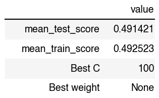

```{r setup, include=FALSE}
knitr::opts_chunk$set(echo = TRUE)
library(tidyverse)
library(knitr)
library(reticulate)
```

## Summary

In this project, we attempt to create a classification prediction model to predict the types of crimes that happens in Vancouver, BC based on neighborhood location and time of the crime. When tested on the unseen test data, the final classifier, LogisticRegression, performed mediocre

## Introduction

Crime is a daily occurrence in large cities, and Vancouver is no exception to this rule. While crime is impossible to avoid in a large metropolitan city, we are interested in seeing if the categories of crimes and timing of crime can be correlated with certain neighborhoods in Vancouver. This project is for educational purposes only and should not be used to predict crime in real life. 

## Methods
The Python programming language [@Python] and the following Python packages were used to perform the analysis: Pandas [@Pandas], Numpy [@Numpy], Sci-Kit Learn [@sklearn], Altair [@altair]


The code used to perform the analysis and create this report can be found here: https://github.com/UBC-MDS/DSCI_522_Crime_Prediction_Vancouver/blob/main/src/modelling.ipynb


## Data
The data was collected by the Vancouver Police Department from 2016 to 2020 and is a log of all crimes committed. Each row in the dataset represents the crime committed, the time of day, neighborhood, the hundreds block the crime occurred on, as well as the X and Y coordinates of the crime location. It is updated weekly by the VPD, but there is about a two to three month lag in logging present day crime. 

## Analysis
In our initial exploratory data analysis, the relationship between neighborhoods and types of crime was examined. From the heatmap below, the Central Business District (compromising of the downtown area) appears to be the most active neighborhood for crime. 

```{r Heatmap, echo=FALSE, fig.height = 10, fig.width = 10, fig.cap = "Fig 1. Heatmap of Crimes and Neighborhood", out.width = "200%"}

include_graphics('../src/figure-eda/crime_correlation.png')

```

This observation was formalized by the histogram below. The Central Business District, followed by neighboring West End, Mount Pleasant, Strathacona, and Fairview are the neighborhoods with the most crime logged by the VPD. 

```{r Top 5 Crime Neighbourhoods , echo=FALSE, fig.height = 10, fig.width = 10, fig.cap = "Fig 2. Top 5 Neighborhoods with Crime", out.width = "200%"}

include_graphics('../src/figure-eda/crime_top5.png')

```

Additionally, we examined the distribution of crimes committed against hours. A significant amount of cases happened in hour 0. However, this appears to be an issue within the dataset. It appears many crimes logged at 0 AM as a default in cases where the original time of the crime is unknown or not available. To counteract this imabalance, data re-balancing was done by averaging out the cases from 0 am and re-distributing into 24 hours.


```{r Hour Rebalancing, echo=FALSE, fig.height = 3, fig.width = 5, fig.cap = "Fig 3.Comparasion of Data Before and After Rebalancing", out.width = "70%"}

include_graphics('../src/figure-preprocess/data_before_balance.png')
include_graphics('../src/figure-preprocess/data_after_balance.png')
```

Prior to model fitting, the data was preprocessed via column transformers. SimpleImputer and OneHotEncoder were applied to the categorical feature, "Neighbourhood". OneHotEncoding was used for the date components, "Year", "Month", "Hour" and "Minute". And finally, SimpleImputer and StandardScaler were applied to "X"and "Y", which are coordinate points of the crime location

The LogisticRegressor algorithm was used to classify the different categories of crimes in Vancouver. It performed best out of the four models tested, which included DummyClassifier (to set a baseline score), RandomForestClassifier, and RidgeClassifier. Scoring was done using f-1, which is the harmonic mean of precision and recall of the classifier. As seen below in figure 1, LogisticRegressor has fractionally higher test scores than RandomForest and RidgeClassifier


```{r Model results, echo=FALSE, fig.height = 10, fig.width = 10, fig.cap = "Fig 4. Model Results", out.width = "200%"}

include_graphics('../results/models_results_cv.png')

```


For LogisticRegression, hyperparameters C and class_weight were optimized via RandomizedSearchCV to maximize f-1. The best model performed using C = 100 and class_weight = None. 

  - Note: due to the time complexity of the model, the hyperparameter optimization took a significant amount of time to complete. RandomizedSearchCV returns the best parameters it can find in a set amount of time, so it's possible that these are not the best parameters overall, but the best parameter that could be fit in the given time frame.
  
```{r Pipeline, echo=FALSE, fig.height = 10, fig.width = 10, fig.cap = "Fig 5. Model Results", out.width = "100%"}



```


From the confusion matrix, we can see that the LogisticRegressor model performed poorly. The model rarely predicted true positives for each label. 

```{r Confusion Mqtrix, echo=FALSE, fig.height = 10, fig.width = 10, fig.cap = "Fig 6. Confusion Matrix of LogisticRegressor performance on test data", out.width = "200%"}

include_graphics('../results/confusion_matrix.png')

```
Furthermore, based on the precision, recall, f1-scores, and support of the classification report, there is further confirmation of the model's poor performance. 
```{r classification report, echo=FALSE, fig.height = 15, fig.width = 10, fig.cap = "Fig 7. Classification Report of Targets", out.width = "300%"}

include_graphics('../results/classification_report.png')

```

## Results and Discussion
Overall, the model created performs poorly on the test and training data. This model would not generalize well on unseen data, and thus could be improved upon in future updates. 

Ultimately, the most likely explanation for the model's poor performance is the quality of input data used. Even with data re-balancing to handle the 0 AM imbalance and hyperparameter optimization, the model did not improve much. To further improve the model in the future, feature engineering could be used to optimize/create new features in the dataset to boost model predictions. Additionally, adding relevant data from an outside source (ie. Vancouver weather, Vancouver housing prices, etc.) could be useful to create more meaningful features for the model to train on. Finally, testing different model than LogisticRegressor, RandomForestClassifier, and RidgeClassifier could also result in a better performing model. 


## References

