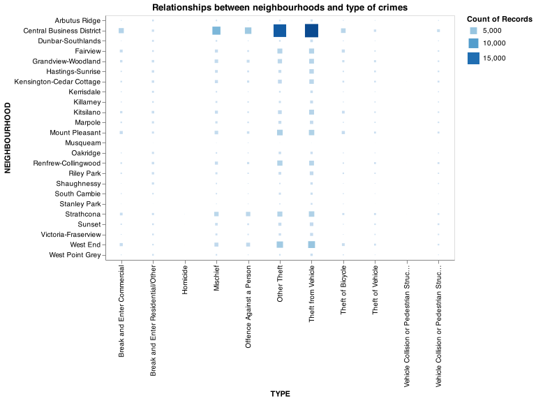
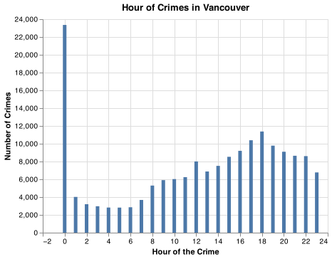

```{r setup, include=FALSE}
knitr::opts_chunk$set(echo = TRUE)
library(tidyverse)
library(knitr)
```

## Summary

In this project, we attempted to create a classification prediction model to predict the types of crimes that happens in Vancouver, BC based on neighborhood location and time of the crime. Based on our EDA results and model tuning, including necessary data cleaning tasks, we identified that the Logistic Regression model performed the best among all the models tested based on f1 score. The performance of predicting the results of the unseen data was not satisfied, that we believed was due to the lack of associations between the features (Time and Location) and crime type. We proposed further improvements in the future iterations of model optimisations, such as including adding relevant data from outside score (i.e. Vancouver weather, Vancouver housing etc).

## Introduction

Crime is a daily occurrence in large cities, and Vancouver is no exception to this rule. While crime is impossible to avoid in a large metropolitan city, we are interested in seeing if the categories of crimes and timing of crime can be correlated with certain neighborhoods in Vancouver. The information is useful for the police to strengthen specific skillsets to cater specific law-breaching activities in different areas. Also, local government officials can utilize the prediction to adjust related policies. This project is for educational purposes only and should not be used to predict crime in real life.

## Methods

The Python programming language [@Python] and the following Python packages are used to perform the analysis: Pandas [@Pandas], Numpy [@Numpy], Sci-Kit Learn [@sklearn], Altair [@altair], dataframe_image [@dataframe_image] and docopt [@docopt].

The code used to perform the analysis and create this report can be found here: <https://github.com/UBC-MDS/DSCI_522_Crime_Prediction_Vancouver/blob/main/src/modelling.ipynb>

## Data

The data was collected by the Vancouver Police Department [@Data] from 2003 to 2021 and is a log of all crimes committed. Each row in the dataset represents the crime committed, the time of day, neighborhood, the hundreds block the crime occurred on, as well as the X and Y coordinates of the crime location. It is updated weekly by the VPD, but there is about a two to three month lag in logging present day crime. To simplify our analysis and prediction modelling, we utilized the data between year 2016 to 2020.

## Analysis

### EDA
In our initial exploratory data analysis, the relationship between neighborhoods and types of crime was examined. From the heatmap below, the Central Business District (compromising of the downtown area) appears to be the most active neighborhood for crime against all neighborhoods.

```{r Heatmap, echo=FALSE, fig.height = 10, fig.width = 10, out.width = "90%"}



```


Figure 1. Heatmap of Crimes and Neighborhood

This observation was formalized by the histogram below. The Central Business District, followed by neighboring West End, Mount Pleasant, Strathacona, and Fairview are the neighborhoods with the most crime logged by the VPD.


Figure 2: Top 5 Neighborhoods with Crime

### Data cleaning

Additionally, we examined the distribution of crimes committed against hours. A significant amount of cases happened in hour 0. However, this appeared to be an issue within the dataset. It appeared many crimes logged at 0 AM as a default in cases where the original time of the crime is unknown or not available. Also, based on the data description provided by the VPD, the hour information was based on the findings of the police investigation. Thus we assumed some examples falling into hour 0 could have happened in other time in the same day. To counteract this imabalance, data re-balancing was done by averaging out the cases from 0 am and re-distributing into 24 hours.


```{r Hour Pre-Rebalancing, echo=FALSE, fig.height = 3, fig.width = 5, out.width = "50%"}


```


Figure 3. Data Before Rebalancing

```{r Hour Rebalancing, echo=FALSE, fig.height = 3, fig.width = 5, out.width = "50%"}

include_graphics('../src/figure-preprocess/data_after_balance.png')
```

Figure 4. The data after rebalancing

### Data transformation

Prior to model fitting, the data was preprocessed via column transformers. SimpleImputer and OneHotEncoder were applied to the categorical feature, "Neighbourhood". OneHotEncoding was used for the date components, "Year", "Month", "Hour" and "Minute". And finally, SimpleImputer and StandardScaler were applied to "X"and "Y", which are coordinate points of the crime location.

### Finding the best performing model

We decided to use f-1 score as our main scoring method that was applicable to multi-class classification problem [@tharwat2020classification]. The LogisticRegressor algorithm was used to classify the different categories of crimes in Vancouver. It performed best out of the four models tested, which included DummyClassifier (to set a baseline score), RandomForestClassifier, and RidgeClassifier. As seen below in figure 5, RandomForest performed the best in the test score (0.503) however it was overfitted. LogisticRegressor yielded a similar score (0.491) which was fractionally higher than RandomForest and RidgeClassifier.


```{r Model results, echo=FALSE, fig.height = 10, fig.width = 10,, out.width = "80%"}

include_graphics('../results/models_results_cv.png')

```


Table 1. Model Results based on f1 score

### Hyperparameter tuning

For LogisticRegression, hyperparameters `C` and `class_weight` were optimized via RandomizedSearchCV to maximize f-1. The best model performed using `C = 100` and `class_weight = None`.

-   Note: due to the time complexity of the model, the hyperparameter optimization took a significant amount of time to complete. RandomizedSearchCV returns the best parameters it can find in a set amount of time, so it's possible that these are not the best parameters overall, but the best parameter that could be fit in the given time frame.

```{r Best Model, echo=FALSE, fig.height = 5, fig.width = 5, out.width = "30%"}

include_graphics('../results/best_LR_model.png')

```

Table 2. Model Results

## Results and Discussion

We conducted the prediction with the best performing model identified after hyperparameter tuning. The result was assessed through the confusion matrix shown below. The confusion matrix can be interpeted as a heatmap, with the number of true positives predicted along the diagonal from top left to bottom right. The model rarely predicted true positives for each label, except those that contained the most sample in the data set, i.e. `Theft from Vehical` and `Other Theft`. 

```{r Confusion Matrix, echo=FALSE, fig.height = 5, fig.width = 5, out.width = "200%"}

include_graphics('../results/confusion_matrix.png')

```

Figure 5. Confusion Matrix of LogisticRegressor performance on test data

Furthermore, based on the classification report of breaking down individual precision, recall, f1-scores, and support score, there is further confirmation of the model's poor performance, where some of the classes had zero success in prediction ( `Homicide`, `Theft of Vehicle`, `Vehicle Collision (with Fatality)`). 

```{r classification report, echo=FALSE, fig.height = 15, fig.width = 10, out.width = "80%"}

include_graphics('../results/classification_report.png')

```


Table 3. Classification Report of Targets


Overall, the model created performs poorly on the test and training data. This model would not generalize well on unseen data, and thus could be improved upon in future updates.

Ultimately, the most likely explanation for the model's poor performance is the quality of input data used. Even with data re-balancing to handle the 0 AM imbalance and hyperparameter optimization, the model did not improve much. To further improve the model in the future, feature engineering could be used to optimize/create new features in the dataset to boost model predictions. Additionally, adding relevant data from an outside source (ie. Vancouver weather, Vancouver housing prices, etc.) could be useful to create more meaningful features for the model to train on. Finally, testing different model than LogisticRegressor, RandomForestClassifier, and RidgeClassifier could also result in a better performing model.

## References
