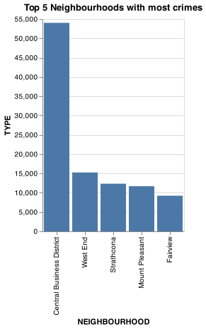
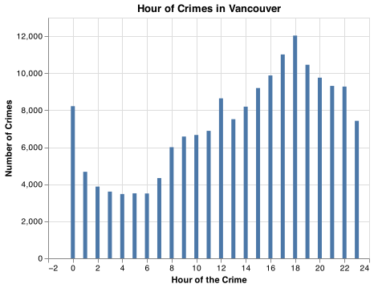
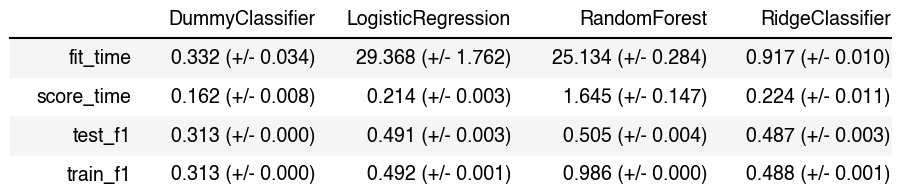

Vancouver Crime Prediction Report
================
Ramiro Francisco Mejia, Jasmine Ortega, Thomas Siu, Shi Yan Wang  

-   [Summary](#summary)
-   [Introduction](#introduction)
-   [Methods](#methods)
-   [Data](#data)
-   [Analysis](#analysis)
-   [Results and Discussion](#results-and-discussion)
-   [References](#references)

## Summary

In this project, we attempt to create a classification prediction model
to predict the types of crimes that happens in Vancouver, BC based on
neighborhood location and time of the crime. When tested on the unseen
test data, the final classifier, LogisticRegression, performed mediocre

## Introduction

Crime is a daily occurrence in large cities, and Vancouver is no
exception to this rule. While crime is impossible to avoid in a large
metropolitan city, we are interested in seeing if the categories of
crimes and timing of crime can be correlated with certain neighborhoods
in Vancouver. This project is for educational purposes only and should
not be used to predict crime in real life.

## Methods

The Python programming language (Van Rossum and Drake Jr 1995) and the
following Python packages were used to perform the analysis: Pandas
(McKinney et al. 2010), Numpy (Harris et al. 2020), Sci-Kit Learn
(Pedregosa et al. 2011), Altair (VanderPlas et al. 2018)

The code used to perform the analysis and create this report can be
found here:
<https://github.com/UBC-MDS/DSCI_522_Crime_Prediction_Vancouver/blob/main/src/modelling.ipynb>

## Data

The data was collected by the Vancouver Police Department from 2016 to
2020 and is a log of all crimes committed. Each row in the dataset
represents the crime committed, the time of day, neighborhood, the
hundreds block the crime occurred on, as well as the X and Y coordinates
of the crime location. It is updated weekly by the VPD, but there is
about a two to three month lag in logging present day crime.

## Analysis

In our initial exploratory data analysis, the relationship between
neighborhoods and types of crime was examined. From the heatmap below,
the Central Business District (compromising of the downtown area)
appears to be the most active neighborhood for crime.

Figure 1: Heatmap of Crimes and Neighborhood

This observation was formalized by the histogram below. The Central
Business District, followed by neighboring West End, Mount Pleasant,
Strathacona, and Fairview are the neighborhoods with the most crime
logged by the VPD.

Figure 2: Top 5 Neighborhoods with Crime

Additionally, we examined the distribution of crimes committed against
hours. A significant amount of cases happened in hour 0. However, this
appears to be an issue within the dataset. It appears many crimes logged
at 0 AM as a default in cases where the original time of the crime is
unknown or not available. To counteract this imabalance, data
re-balancing was done by averaging out the cases from 0 am and
re-distributing into 24 hours.

Figure 3. The data prior to data balancing:

Figure 4. The data after rebalancing:

Prior to model fitting, the data was preprocessed via column
transformers. SimpleImputer and OneHotEncoder were applied to the
categorical feature, “Neighbourhood.” OneHotEncoding was used for the
date components, “Year,” “Month,” “Hour” and “Minute.” And finally,
SimpleImputer and StandardScaler were applied to “X”and “Y,” which are
coordinate points of the crime location

The LogisticRegressor algorithm was used to classify the different
categories of crimes in Vancouver. It performed best out of the four
models tested, which included DummyClassifier (to set a baseline score),
RandomForestClassifier, and RidgeClassifier. Scoring was done using f-1,
which is the harmonic mean of precision and recall of the classifier. As
seen below in figure 1, LogisticRegressor has fractionally higher test
scores than RandomForest and RidgeClassifier

For LogisticRegression, hyperparameters C and class_weight were
optimized via RandomizedSearchCV to maximize f-1. The best model
performed using C = 100 and class_weight = None.

-   Note: due to the time complexity of the model, the hyperparameter
    optimization took a significant amount of time to complete.
    RandomizedSearchCV returns the best parameters it can find in a set
    amount of time, so it’s possible that these are not the best
    parameters overall, but the best parameter that could be fit in the
    given time frame.

Fig 5. Model Results 

From the confusion matrix, we can see that the LogisticRegressor model
performed poorly. The confusion matrix can be interpeted as a heatmap,
with true positives predicted along the diagonal. The model rarely
predicted true positives for each label.

Furthermore, based on the precision, recall, f1-scores, and support of
the classification report, there is further confirmation of the model’s
poor performance.

## Results and Discussion

Overall, the model created performs poorly on the test and training
data. This model would not generalize well on unseen data, and thus
could be improved upon in future updates.

Ultimately, the most likely explanation for the model’s poor performance
is the quality of input data used. Even with data re-balancing to handle
the 0 AM imbalance and hyperparameter optimization, the model did not
improve much. To further improve the model in the future, feature
engineering could be used to optimize/create new features in the dataset
to boost model predictions. Additionally, adding relevant data from an
outside source (ie. Vancouver weather, Vancouver housing prices, etc.)
could be useful to create more meaningful features for the model to
train on. Finally, testing different model than LogisticRegressor,
RandomForestClassifier, and RidgeClassifier could also result in a
better performing model.

## References

Harris, Charles R., K. Jarrod Millman, Stéfan J van der Walt, Ralf
Gommers, Pauli Virtanen, David Cournapeau, Eric Wieser, et al. 2020.
“Array Programming with NumPy.” *Nature* 585: 357–62.
<https://doi.org/10.1038/s41586-020-2649-2>.

McKinney, Wes et al. 2010. “Data Structures for Statistical Computing in
Python.” In *Proceedings of the 9th Python in Science Conference*,
445:51–56. Austin, TX.

Pedregosa, Fabian, Gaël Varoquaux, Alexandre Gramfort, Vincent Michel,
Bertrand Thirion, Olivier Grisel, Mathieu Blondel, et al. 2011.
“Scikit-Learn: Machine Learning in Python.” *Journal of Machine Learning
Research* 12 (Oct): 2825–30.

Van Rossum, Guido, and Fred L Drake Jr. 1995. *Python Tutorial*. Centrum
voor Wiskunde en Informatica Amsterdam, The Netherlands.

VanderPlas, Jacob, Brian Granger, Jeffrey Heer, Dominik Moritz, Kanit
Wongsuphasawat, Arvind Satyanarayan, Eitan Lees, Ilia Timofeev, Ben
Welsh, and Scott Sievert. 2018. “Altair: Interactive Statistical
Visualizations for Python.” *Journal of Open Source Software* 3 (32):
1057.

