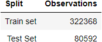
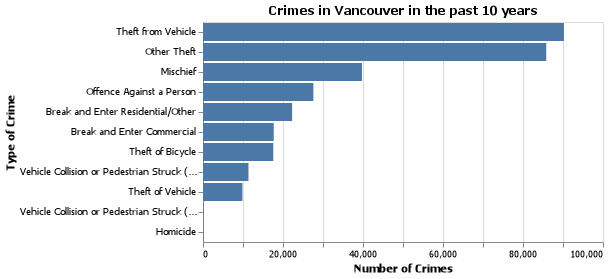
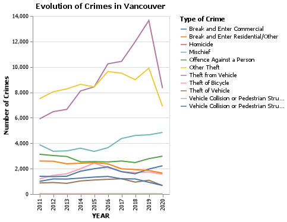
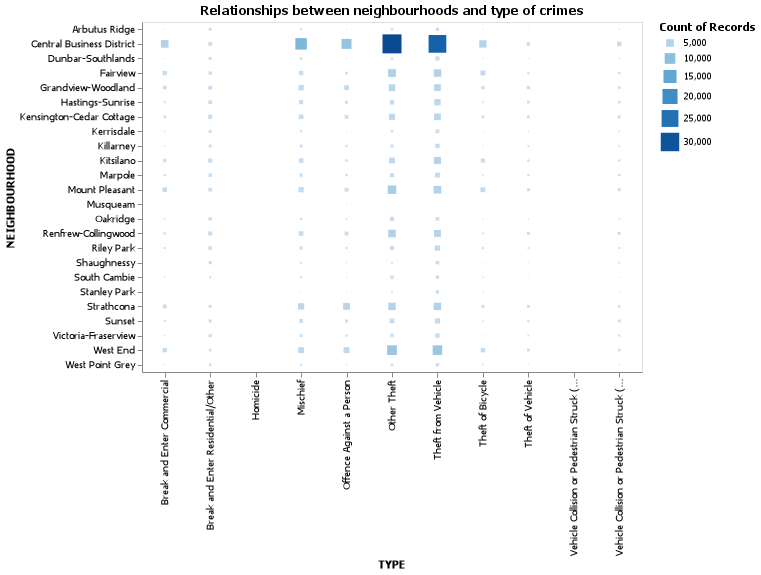
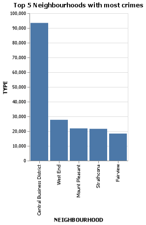

# Exploratory data analysis of Crimes in Vancouver data set

# Summary of the data set

The data set used in this project comes from the Vancouver Police Department Open Data (The Vancouver Police Department, 2021) and can be found here (https://geodash.vpd.ca/opendata/). Each row in the data set represents a reported crime in Vancouver, including crime type, date (in year, month, day, hour, minute), block address and neighbourhood name. The data set covers cases from 2003 to 2021 of a total 782,749 cases. For the visualization purpose, we focus on past 10 years data here (from 2020 to 2021).
Below we show the number of reported crimes for each neighbourhoods. Note there are 24 neighbourhoods in Vancouver.

<!-- -->

Table 1: Count of crimes of each Neighbourhood.

# Data split into training and test sets

Data is split in a way that 75% observations are in the training data set and 25% are for testing. Below we list the counts of observations of both classes:

<!-- -->

Table 2. Count of observations of each class.

We will now further investigate the training data set on its trends and correlations.

# Explorary analysis on the training data set

First we explore the type of crimes to see if certain crime is of our best interest. From the distribution of crime types, we learn that over 50% of crimes are theft from vehicle and other theft. 

<!-- -->

Figure 1. Crimes in Vancouver in the past 10 years

If we look at how the crimes evolved over the past 10 years, we can see that the crime cases level are relative stable from 2011 to 2018. However, there's a steep increase in 2018 where theft from vehicle surpassed other theft and became the most common crime type in Vancouver. This may due to the start of Covid that causes a series of social problems. However, the data set does not provide more insights into the reasons and this is not the focus on this project.

<!-- -->

Figure 2. Evolution of Crimes in Vancouver from 2011 to 2020

To view where most observations lie and the correlation between neighbourhood and types of crime, we plot the categorical groups with the correlation plot as below. We can see that data concentrate on some categorical groups. For example, a high volumn of thefts (both from vehicle and other) are reported at Arbutus Ridge Neighbourhood. This indicates that there can be some relationships between types of crime and neighbourhoods. 

<!-- -->

Figure 3. Relationships between neighbourhoods and type of crimes

Below you can find the top 5 neighbourhoods with most reported crime cases, which suggests that crimes are more likely to happen in certain neighbourhoods. 

<!-- -->

Figure 4. Top 5 Neighbourhoods with most crimes

# Reference

The Vancouver Police Department. 2021. “Vancouver Police Department Open Data”
The Vancouver Police Department. <https://geodash.vpd.ca/opendata/>.
