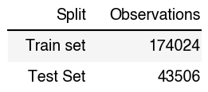
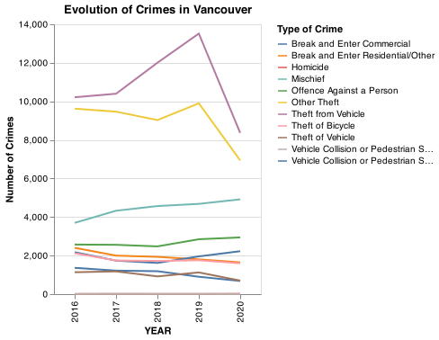

Exploratory data analysis of Crimes in Vancouver data set
================
Ramiro Francisco Mejia, Jasmine Ortega, Thomas Siu, Shi Yan Wang  
2021-12-03

-   [Summary of the data set](#summary-of-the-data-set)
-   [Data split into training and test
    sets](#data-split-into-training-and-test-sets)
-   [Explorary analysis on the training data
    set](#explorary-analysis-on-the-training-data-set)
-   [Reference](#reference)

# Summary of the data set

The data set used in this project comes from the Vancouver Police
Department Open Data (The Vancouver Police Department 2021). Each row in
the data set represents a reported crime in Vancouver, including crime
type, date (in year, month, day, hour, minute), block address, and
neighbourhood name. The data set covers cases from 2003 to 2021 of a
total of 782,749 cases. For the visualization and model prediction
purpose, we focus on the past five years’ data here (from 2016 to 2020).
Below we show the number of reported crimes for each neighbourhoods.
Note there are 24 neighbourhoods in Vancouver.

<!-- -->

Table 1: Count of crimes of each Neighbourhood.

# Data split into training and test sets

Data is split in a way that 80% observations are in the training data
set and 20% are for testing. Below we list the counts of observations of
both classes:

<!-- -->

Table 2. Count of observations of each class.

We will now further investigate the training data set on its trends and
correlations.

# Explorary analysis on the training data set

First, we explore the type of crimes to see if a certain crime is in our
best interest. From below distribution of crime types, over 50% of
crimes are theft from vehicle and other theft.

<!-- -->

Figure 1. Crimes in Vancouver bewteen 2016 and 2020

If we look at how the crimes evolved over the past five years, we can
see that the crime cases level is relatively stable from 2016 to 2017.
However, there’s a steep increase in 2018 where theft from vehicles
surpassed other theft and became the most common crime type in
Vancouver. This may be due to the start of Covid that causes a series of
social problems. However, the data set does not provide more insights
into the reasons, and this is not the focus of this project.

<!-- -->

Figure 2. Evolution of Crimes in Vancouver from 2016 to 2020

To view where most observations lie and the correlation between
neighbourhood and types of crime, we plot the categorical groups with
the correlation plot as below. We can see that data concentrate on some
categorical groups. For example, a high volume of thefts (both from
vehicles and others) are reported at Central Business District. This
indicates that there can be some relationships between types of crime
and neighbourhoods.

<!-- -->

Figure 3. Relationships between neighbourhoods and type of crimes

Below you can find the top 5 neighbourhoods with the most reported crime
cases, which suggests that crimes are more likely to happen in certain
neighbourhoods.

<!-- -->

Figure 4. Top 5 Neighbourhoods with most crimes

# Reference

The Vancouver Police Department. 2021. *Vancouver Department Open Data*.
<https://geodash.vpd.ca/opendata/>.

