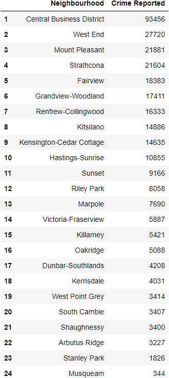

# Exploratory data analysis of Crimes in Vancouver data set

# Summary of the data set

The data set used in this project comes from the Vancouver Police Department Open Data and can be found here. Each row in the data set represents a reported crime in Vancouver, including crime type, date (in year, month, day, hour, minute), block address and neighbourhood name. The data set covers cases from 2003 to 2021 of a total 782,749 cases. For the visualization purpose, we focus on past 10 years data here (from 2020 to 2021).
Below we show the number of reported crimes for each neighbourhoods. Note there are 24 neighbourhoods in Vancouver.

<!-- -->
